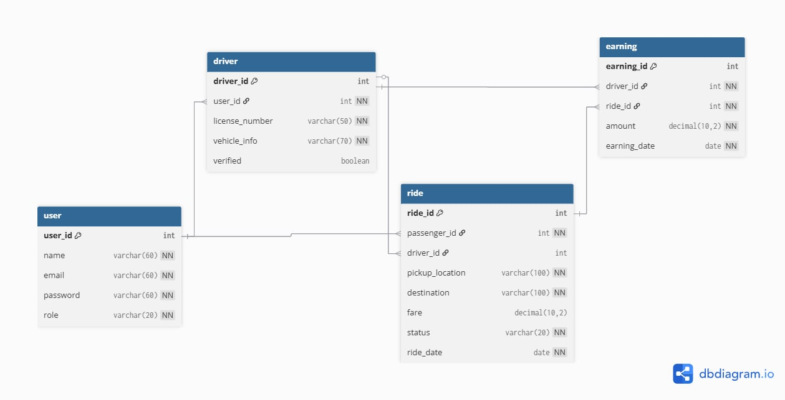
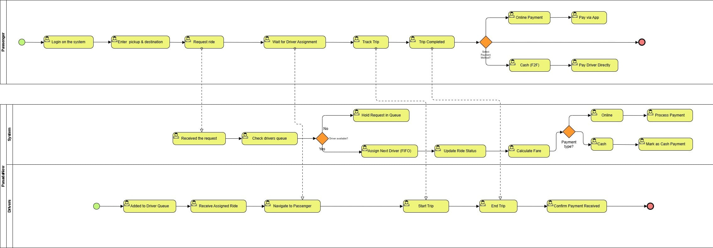

# Project Manifesto

## 1. Project Title & One-Liner

**Project Title:** PasadaNow – Tricycle Ride-Hailing System  

**One-Liner:** A web-based and mobile-based ride-hailing system for tricycle commuters and drivers that makes booking, tracking, and managing tricycle rides safe, fast, and transparent.

---

## 2. The Problem Statement

**For:** Daily commuters and tricycle drivers in urban and rural communities  

**Who wants to:** Book and provide tricycle rides conveniently without long wait times, unsafe practices, or inconsistent fares  

**Our project is a:** Web-based and Mobile-based tricycle ride-hailing system  

**That provides:** Real-time booking, location tracking, transparent fare calculation, and secure ride management for both passengers and drivers  

---

## 3. User Persona

### Persona 1: Passenger/Commuters

**Name:** Juan Dela Cruz  

**Role / Situation:** College student who relies on tricycles for daily commuting  

**Goals:**
- Book a tricycle quickly  
- Know the fare in advance  
- Feel safe during trips  

**Frustrations:**
- Long waiting times  
- Fare negotiations  
- No way to track or report rides  

---

### Persona 2: Tricycle Driver

**Name:** Mang Pedro  

**Role / Situation:** Full-time tricycle driver  

**Goals:**
- Receive consistent ride requests  
- Track daily earnings  
- Avoid fare disputes  

**Frustrations:**
- Irregular passengers  
- Manual tracking of income  
- No centralized system  

---

## 4. Feature Prioritization (MoSCoW Method)

### Must Have (MVP Launch-Critical)
- User and driver registration & authentication  
- Ride booking and driver acceptance  
- Real-time location tracking during trips  
- Basic fare calculation and notifications  

### Should Have (Important, but not for V1)
- Trip history and digital ride receipts  
- Driver earnings dashboard (weekly/monthly)  
- Rating and review system  

### Could Have (Nice Additions for the Future)
- In-app chat between passenger and driver  
- Promo codes or discounts  
- Multi-language support  

### Won’t Have (Explicitly Out of Scope)
- Advanced AI route optimization  
- Integration with national ID systems  
- Support for cars or motorcycles  

---

## 5. Core User Flow (BPMN – Summary)

### Passenger Flow:
Login → Enter pickup & destination → Request ride → Wait for driver assignment → Track trip → Complete ride → Select payment method (Online / Cash) → View fare  

### Driver Flow:
Login → Join driver queue → Receive ride request → Accept / Decline → Navigate to passenger → Start trip → End trip → Confirm payment → View earnings  

---

## 6. High-Level Data Schema

### Your Data Models:

**User**  
id, name, email, password_hash, role  

**Driver**  
id, user_id, license_no, vehicle_info, verified_status  

**Ride**  
id, passenger_id, driver_id, pickup_location, destination, fare, status  

**Earnings**  
id, driver_id, ride_id, amount, date  

#
**Physical ERD**

#

**BPMN**

---

## 7. Proposed Tech Stack

**Frontend:** HTML, CSS, JavaScript  

**Backend:** XAMPP, Python, Java (Spring Boot)  

**Database:** PostgreSQL  

---

## 8. MVP Milestone Tracker (6-Week Plan)

**Week 1 Goal:** Requirements analysis, wireframes, database design  

**Week 2 Goal:** User & driver authentication (backend + frontend)  

**Week 3 Goal:** Ride booking and driver acceptance logic  

**Week 4 Goal:** GPS/location tracking and fare calculation  

**Week 5 Goal:** Driver dashboard and notifications  

**Week 6 Goal:** Testing, bug fixes, documentation  

---

## 9. Definition of Done

- Passenger can successfully book a ride  
- Driver can accept and complete rides  
- Fare is calculated and displayed correctly  
- System runs without critical bugs  
- MVP demo is deployable and presentable  
